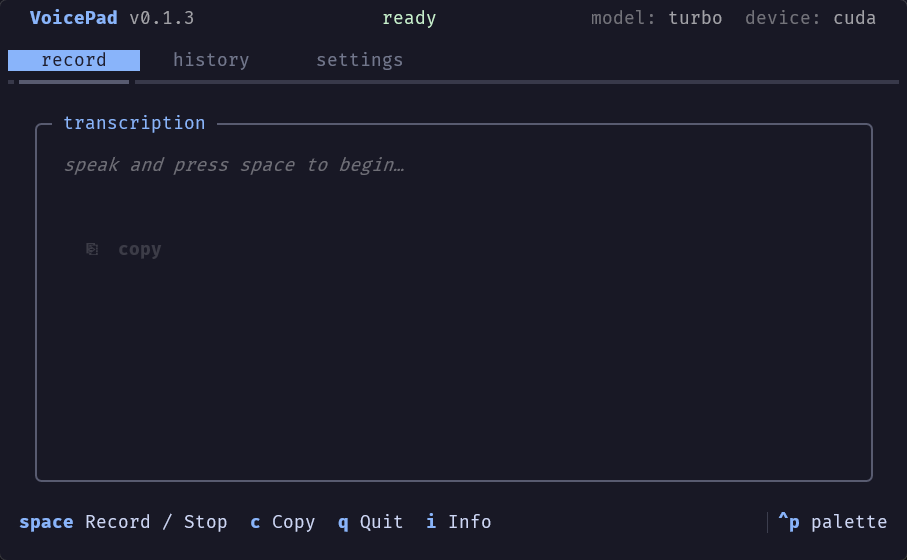

# VoicePad

**Your private, local-first dictation studio.**

Record audio and get instant transcriptions — entirely on your machine. No cloud, no subscriptions, no data leaving your hardware.

```bash
uvx voicepad
```



## Why VoicePad?

Most transcription tools ship your voice to a cloud API. VoicePad doesn't. Everything runs locally, powered by [faster-whisper](https://github.com/SYSTRAN/faster-whisper) and your NVIDIA GPU.

- **100% local** — audio never leaves your machine
- **GPU-accelerated** — 60-second recording transcribed in ~3 seconds on an RTX 3050
- **Re-transcribe anytime** — original WAV files are always saved alongside your markdown notes
- **Zero setup** — CUDA libraries are bundled, no separate CUDA install needed

## Quick Start

Requires [uv](https://docs.astral.sh/uv/getting-started/installation/).

```bash
# Run instantly, no install needed
uvx voicepad

# Or install permanently
uv tool install voicepad
voicepad
```

Press `Space` to record, `Space` again to stop. Transcription starts immediately.

## Requirements

- Python 3.13+
- Windows or Linux
- Any microphone your OS recognises
- NVIDIA GPU (optional, but recommended for fast transcription)

## Documentation

Full docs at **[voicepad.hyperoot.dev](https://voicepad.hyperoot.dev)**

- [Getting Started](https://voicepad.hyperoot.dev/getting-started/)
- [Interface](https://voicepad.hyperoot.dev/interface/)
- [Configuration](https://voicepad.hyperoot.dev/configuration/)
- [GPU Acceleration](https://voicepad.hyperoot.dev/configuration/gpu/)

## License

[MIT](LICENSE)
