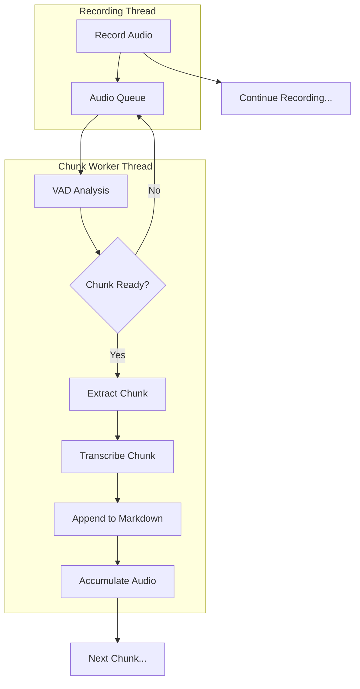

# Background Transcription

Background transcription processes audio chunks in real-time while recording continues, providing immediate feedback and eliminating wait time at the end of long recordings.

## What is Background Transcription?

When VAD chunking is enabled, Voicepad transcribes each chunk in the background as soon as it's extracted:



**Key principle:** Recording and transcription happen simultaneously, not sequentially.

## How It Works

### 1. Chunk Detection

When VAD detects a natural speech boundary:

- Chunk audio is extracted from the buffer
- Chunk is added to the transcription queue
- Recording continues uninterrupted

### 2. Background Transcription Thread

A dedicated worker thread:

1. ✅ Monitors queue for new chunks
2. ✅ Transcribes each chunk using Whisper model
3. ✅ Appends result to markdown file (thread-safe)
4. ✅ Accumulates audio data in memory
5. ✅ Continues until recording stops

### 3. Model Caching

The first chunk load the Whisper model into memory. Subsequent chunks reuse the cached model:

```python
# First chunk: Load model (~2-5 seconds)
Chunk 1: [Load Model] → [Transcribe 60s audio in 3s]

# Subsequent chunks: Reuse cached model (~0 seconds overhead)
Chunk 2: [Transcribe 60s audio in 3s]
Chunk 3: [Transcribe 60s audio in 3s]
```

**Result:** Only the first chunk has loading overhead!

### 4. Thread-Safe Writing

Multiple chunks may be transcribing simultaneously (if transcription is fast). A lock ensures markdown file updates are sequential and never corrupted:

```python
with markdown_lock:
    append_to_file(chunk_transcription)
```

## Real-Time Markdown Updates

### Live Progress

Open the markdown file while recording to watch transcription appear:

```markdown
# Transcription: meeting_20260218_033000.wav

**Status:** Recording in progress...

---

## Chunk 1 (0:00 - 1:15)

Welcome everyone to today's meeting. We'll be discussing...

## Chunk 2 (1:15 - 2:45)

[This appears while you're still recording chunk 3]

First on the agenda is the project timeline...
```

!!! tip "Live Viewing"
    Use a markdown viewer with auto-refresh to see transcription update live.
    VS Code's markdown preview auto-updates when the file changes.

### Completion Status

When recording stops, the status updates:

```markdown
**Status:** Recording complete ✓

---

**Recording Complete**
- Total chunks: 5
- Total duration: 8:25
```

## Audio File Output

### Memory Accumulation

Chunk audio data is kept in memory (not saved individually):

```python
accumulated_chunks = [
    chunk_1_audio,  # 60 seconds
    chunk_2_audio,  # 58 seconds
    chunk_3_audio,  # 62 seconds
]
```

### Single Merged File

When recording stops, all chunks merge into one WAV file:

```python
merged_audio = concatenate(accumulated_chunks)
save_to_file("recording_20260218_033000.wav")
```

**Result:** One continuous audio file, no chunk files on disk.

## Performance

### Transcription Speed

Speed depends on device and model:

**GPU (CUDA):**

- Tiny model: 20-40x real-time (60s → 1.5-3s)
- Medium model: 10-20x real-time (60s → 3-6s)
- Large model: 5-10x real-time (60s → 6-12s)

**CPU:**

- Tiny model: 3-8x real-time (60s → 7.5-20s)
- Medium model: 1-3x real-time (60s → 20-60s)
- Large model: 0.5-1x real-time (60s → 60-120s)

!!! warning "CPU with Large Models"
    On CPU, large models may transcribe slower than real-time. This means chunks
    can pile up faster than they're processed, causing delays.

### Optimal Settings

**For smooth background transcription:**

```yaml
# GPU users (fast transcription)
vad_min_chunk_duration: 60.0
transcription_model: medium
transcription_device: cuda

# CPU users (slower transcription)
vad_min_chunk_duration: 120.0    # Larger chunks, less frequent
transcription_model: tiny         # Faster model
transcription_device: cpu
```

## Error Handling

### Transcription Failures

If a chunk fails to transcribe:

- ✅ Error logged with details
- ✅ Worker continues processing next chunk
- ✅ Recording is not interrupted
- ✅ Failed chunk is still saved in audio file

The markdown will show:

```markdown
## Chunk 3 (2:30 - 3:45)

[Transcription failed for this chunk]
```

### Worker Resilience

The chunk worker is designed to never crash:

```python
try:
    transcribe_chunk()
except Exception as e:
    log_error(e)
    continue  # Process next chunk
```

**Even if transcription fails completely, you still get the audio file!**

## Monitoring Progress

### Log Output

Watch the terminal for real-time progress:

```text
[INFO] Chunk 1 ready (62.3s), transcribing...
[INFO] Chunk 1 transcribed successfully
[INFO] Chunk 2 ready (59.8s), transcribing...
[INFO] Chunk 2 transcribed successfully
```

### Chunk Worker Status

On stop, see summary:

```text
[INFO] Chunk worker stopped. Processed 5 chunks, accumulated 5 total chunks
[INFO] Saving 5 accumulated chunks...
[INFO] Recording saved to: data/recordings/meeting_20260218_033000.wav
[INFO] Total duration: 8:25.6 seconds
```

## Comparison: With vs Without Background Transcription

### Traditional (No VAD)

```text
Timeline: [Record 10 min] → [Stop] → [Transcribe 2 min] → [Done]

Total time: 12 minutes
Wait time: 2 minutes

Output timing:
- Audio: Available immediately
- Transcription: Available after 2 minutes
```

### Background Transcription (VAD Enabled)

```text
Timeline: [Record 10 min with live transcription] → [Stop] → [Done]

Total time: 10 minutes
Wait time: ~0 seconds (finalization only)

Output timing:
- Audio: Available after finalization (~2 seconds)
- Transcription: 80% available during recording, 100% within 5 seconds of stop
```

**Time saved:** 2 minutes of waiting!

## Use Cases

### ✅ Ideal For

- **Long meetings** - See transcription while meeting continues
- **Interviews** - Review what was said while still recording
- **Lectures** - Watch notes appear in real-time
- **Monitoring** - Know if transcription quality is good before recording ends

### ⚠️ Considerations

- **Resource usage** - Transcription uses CPU/GPU while recording
- **Battery impact** - Laptop users may see faster battery drain
- **Disk I/O** - Markdown file updates frequently

## Technical Details

### Threading Model

```python
# Main thread
recorder.start_recording()  # Starts:
  → recording_thread          # Captures audio
  → chunk_worker_thread       # Processes chunks

# On stop
recorder.stop_recording()     # Waits for:
  → recording_thread.join()   # Audio capture stops
  → chunk_worker.finalize()   # Final chunk processed
  → save_accumulated_audio()  # Merge and save
```

### Queue Management

Audio frames flow through a queue:

```python
audio_queue = Queue()

# Recording thread adds frames
audio_queue.put(audio_frame)

# Chunk worker consumes frames
frame = audio_queue.get(timeout=0.5)
chunker.add_audio(frame)
```

When recording stops:

1. Chunk worker drains remaining frames
2. Finalizes last chunk
3. Transcribes final chunk
4. Updates markdown completion

## See Also

- **[VAD Chunking](vad-chunking.md)** - How chunks are created
- **[Transcription Models](transcription-models.md)** - Choosing the right model
- **[Long Recordings Guide](../guides/long-recordings.md)** - Best practices
- **[GPU Acceleration](../packages/voicepad-core/gpu-acceleration/index.md)** - Faster transcription
