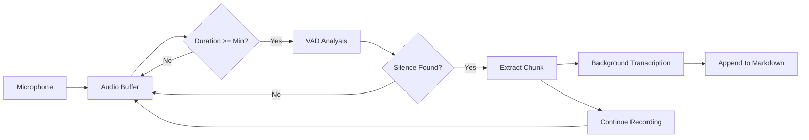

# VAD Chunking

Voice Activity Detection (VAD) chunking automatically splits long recordings into smaller chunks at natural speech boundaries, enabling real-time background transcription.

## What is VAD Chunking?

VAD chunking uses AI-powered voice detection (Silero VAD) to identify when you're speaking and when you're silent. When a chunk reaches the minimum duration and a natural silence is detected, Voicepad:

1. ✂️ **Splits** the audio at the silence boundary
2. 🎯 **Transcribes** the chunk in the background
3. 📝 **Appends** to the markdown file in real-time
4. ♻️ **Continues** recording without interruption

The result: see your transcription update live while you're still recording!

## Why Use VAD Chunking?

### Without VAD (Traditional)

```text
[Record 30 minutes] → [Stop] → [Wait 5 minutes for transcription] → [Read result]
```

### With VAD Chunking

```text
[Record 30 minutes with live transcription updates] → [Stop] → [Read result immediately]
```

**Benefits:**

- 🚀 **Reduced wait time** - No waiting at the end, transcription happens during recording
- 👀 **Live feedback** - Watch transcription appear in real-time
- 💾 **Memory efficient** - Processes chunks instead of entire recording
- 🎯 **Natural splits** - Chunks break at silences, not mid-sentence

## How It Works



### Step-by-Step Process

1. **Audio Buffering** - Incoming audio accumulates in a rolling buffer
2. **Duration Check** - Once `min_chunk_duration` is reached, VAD analysis begins
3. **Speech Detection** - Silero VAD identifies speech vs. silence regions
4. **Boundary Detection** - Finds the last speech segment with sufficient silence after it
5. **Chunk Extraction** - Splits audio at the silence boundary
6. **Background Transcription** - Chunk transcribes while recording continues
7. **Markdown Update** - Transcription appends to the file (thread-safe)
8. **Buffer Reset** - Remaining audio stays in buffer for next chunk

## Configuration Parameters

### Enable VAD Chunking

```yaml
vad_enabled: true
```

```bash
voicepad record start --vad
```

### Minimum Chunk Duration

**`vad_min_chunk_duration`** - Seconds before allowing splits

```yaml
vad_min_chunk_duration: 60.0  # Default: 60 seconds
```

```bash
voicepad record start --vad --min-chunk-duration 120
```

**What it does:**

- Audio must accumulate this long before VAD looks for boundaries
- Ensures chunks have enough context for accurate transcription
- Prevents tiny, fragmented chunks

**Recommended values:**

- **Short answers (Q&A):** 30-45 seconds
- **Normal conversation:** 60 seconds (default)
- **Lectures/presentations:** 90-120 seconds

!!! warning "Minimum: 10 seconds"
    Values below 10 seconds are not allowed to maintain transcription quality.

### Speech Detection Threshold

**`vad_threshold`** - Probability threshold for detecting speech (0.0 - 1.0)

```yaml
vad_threshold: 0.5  # Default: 0.5
```

```bash
voicepad record start --vad --vad-threshold 0.45
```

**What it does:**

- Higher values = more strict (less likely to detect as speech)
- Lower values = more lenient (more likely to detect as speech)

**Recommended values:**

- **Noisy environment:** 0.6-0.7 (stricter)
- **Normal environment:** 0.5 (default)
- **Quiet environment:** 0.4-0.45 (more sensitive)

!!! tip "Tuning the Threshold"
    If chunks split too early (mid-sentence), increase threshold to 0.6.
    If chunks never split, decrease threshold to 0.4.

### Minimum Silence Duration

**`vad_min_silence_duration_ms`** - Milliseconds of silence needed to trigger split

```yaml
vad_min_silence_duration_ms: 1000  # Default: 1000ms (1 second)
```

**What it does:**

- Controls how long a pause must be before creating a chunk boundary
- Prevents splitting at brief pauses (breaths, short hesitations)

**Recommended values:**

- **Fast speech/Q&A:** 500-800ms
- **Normal conversation:** 1000ms (default)
- **Slow/deliberate speech:** 1500-2000ms

### Speech Padding

**`vad_speech_pad_ms`** - Milliseconds added to each side of speech segments

```yaml
vad_speech_pad_ms: 400  # Default: 400ms
```

**What it does:**

- Adds buffer before and after detected speech
- Prevents cutting off beginning/end of words

**Recommended values:**

- Usually keep at **400ms** (default)
- Can reduce to **300ms** for very clear audio
- Increase to **500-600ms** if words are being cut off

## When to Use VAD Chunking

### ✅ Recommended For

- **Long recordings** (10+ minutes)
- **Meetings and interviews**
- **Lectures and presentations**
- **Dictation sessions**
- **When you want live transcription feedback**

### ❌ Not Recommended For

- **Short recordings** (< 5 minutes) - overhead not worth it
- **Continuous speech** with few pauses - may never chunk
- **Music or non-speech audio** - VAD won't detect proper boundaries
- **When you need exact timing** - chunk splits may not align perfectly

## Output Format

### With VAD Enabled

Markdown file updates in real-time with timestamped chunks:

```markdown
# Transcription: recording_20260218_033000.wav

**Status:** Recording in progress...

---

## Chunk 1 (0:00 - 1:12)

This is the transcribed text from the first chunk...

## Chunk 2 (1:12 - 2:45)

Continuing with the second chunk...

## Chunk 3 (2:45 - 4:20)

The third chunk appears here...

---

**Recording Complete**
- Total chunks: 3
- Total duration: 4:20
```

### Without VAD

Single transcription block after recording:

```markdown
# Transcription

**Language:** English (98.5%)
**Date:** 2026-02-18 03:30:00

---

All the transcribed text in one block...
```

## Troubleshooting

### Chunks Are Too Small

**Problem:** Chunks are 10-20 seconds, shorter than `min_chunk_duration`

**Solution:** The minimum is enforced, so this shouldn't happen. If it does, check your configuration and verify `vad_min_chunk_duration` is set correctly.

### Chunks Never Split

**Problem:** Recording for 10 minutes, but only one chunk created

**Possible causes:**

1. **No silence detected** - Continuous speech with no pauses
2. **Threshold too high** - VAD not detecting speech boundaries
3. **Minimum silence too long** - Pauses aren't long enough

**Solutions:**

- Lower `vad_threshold` to 0.4-0.45 (more sensitive)
- Reduce `vad_min_silence_duration_ms` to 500-800ms
- Speak with intentional pauses

### Chunks Split Mid-Sentence

**Problem:** Chunks break in the middle of sentences

**Solutions:**

- Increase `vad_threshold` to 0.6 (stricter speech detection)
- Increase `vad_min_silence_duration_ms` to 1500-2000ms
- Speak more continuously with fewer pauses

## Performance Considerations

**Memory Usage:**

- Buffers audio until chunk boundary found
- Typically 60-120 seconds of audio in RAM (~2-4 MB)

**CPU Usage:**

- VAD analysis runs periodically (not every frame)
- Minimal overhead (~1-2% CPU)

**Transcription Speed:**

- Chunks transcribe in parallel with recording
- GPU: ~10-20x real-time (60s chunk → 3-6s transcription)
- CPU: ~1-5x real-time (60s chunk → 12-60s transcription)

## See Also

- **[Background Transcription](background-transcription.md)** - How chunks are transcribed
- **[VAD Settings Reference](../reference/vad.md)** - Detailed parameter documentation
- **[Long Recordings Guide](../guides/long-recordings.md)** - Best practices
- **[Configuration](../configuration.md)** - Setting up VAD in config file
