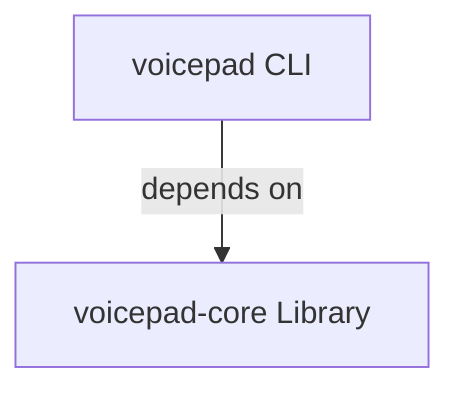

# Package Architecture

Voicepad uses a layered architecture with two separate packages, each serving a distinct purpose.

## Package Overview

| Package | Type | Purpose |
| --- | --- | --- |
| `voicepad-core` | Library | Configuration and GPU diagnostics utilities |
| `voicepad` | CLI Application | Command-line interface for configuration inspection |

## Architecture Pattern

The project follows a **layered architecture** separating the core library from the user-facing application:

**voicepad CLI:** End-user interface with Typer commands for configuration inspection

**voicepad-core Library:** Reusable foundation providing configuration and GPU diagnostics

## When to Use Each Package

**Use `voicepad-core` when:**

- Building a Python application that needs Voicepad configuration
- Validating GPU readiness for faster-whisper or CTranslate2
- Integrating diagnostics into an internal tool or workflow
- You need programmatic access to config or GPU checks

**Use `voicepad` when:**

- You want a ready-to-use command-line tool
- Checking configuration state is sufficient
- You don't need to integrate config loading into custom code
- You prefer a simple CLI over writing Python code

???+ tip "Benefit of This Design"
    Other projects can depend on `voicepad-core` without pulling in CLI dependencies like Typer. This keeps the core library lightweight and reusable, while the CLI wrapper provides convenience for end users.

## Next Steps

- [Explore voicepad-core](voicepad-core/index.md) for library usage
- [Explore voicepad CLI](voicepad/index.md) for command-line usage
