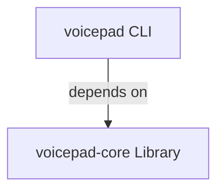

# Package Architecture

Voicepad uses a layered architecture with two separate packages, each serving a distinct purpose.

## Package Overview

| Package | Type | Purpose |
| --- | --- | --- |
| `voicepad-core` | Library | Core audio recording functionality for Python projects |
| `voicepad` | CLI Application | Command-line interface for end users |

## Architecture Pattern

The project follows a **layered architecture** separating the core library from the user-facing application:

**voicepad CLI:** End-user interface with Typer commands for voice recording

**voicepad-core Library:** Reusable foundation providing audio recording, device management, and configuration

## When to Use Each Package

**Use `voicepad-core` when:**

- Building another Python application that needs audio recording
- Creating a library that requires audio capture functionality
- Integrating voice recording into existing Python projects
- You need programmatic control over recording

**Use `voicepad` when:**

- You want a ready-to-use command-line tool
- Recording voice from the terminal is sufficient
- You don't need to integrate recording into custom code
- You prefer a simple CLI over writing Python code

???+ tip "Benefit of This Design"
    Other projects can depend on `voicepad-core` without pulling in CLI dependencies like Typer. This keeps the core library lightweight and reusable, while the CLI wrapper provides convenience for end users.

## Next Steps

- [Explore voicepad-core](voicepad-core/index.md) for library usage
- [Explore voicepad CLI](voicepad/index.md) for command-line usage
