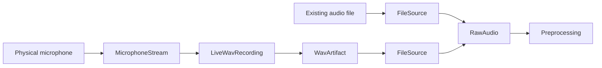
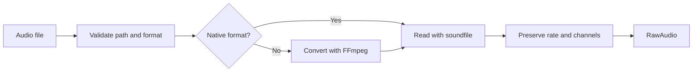

# Audio lifecycle

This guide explains how audio enters VoicePad, remains safe during recording,
and reaches preprocessing. It describes concepts and ownership boundaries
rather than documenting every Python file.

## The core vocabulary

| Contract | Meaning |
|---|---|
| `RawAudio` | Complete source samples with their real sample rate and channel count |
| `WaveformSpec` | The waveform format required by an inference backend |
| `AudioWindow` | A bounded mono range identified by its absolute sample position |
| `WavArtifact` | Metadata describing a completed WAV file on disk |

These contracts keep samples and their meaning together. Preprocessing can
therefore consume audio without guessing its rate, channels, origin, or
position in a recording.

## Two ways audio enters VoicePad



The microphone path prioritizes continuous, recoverable recording. The file
path prioritizes loading a completed recording. Both paths eventually produce
`RawAudio` for preprocessing.

## Live microphone lifecycle

### 1. Prepare storage

VoicePad starts `LiveWavRecording` before opening the microphone. This ensures
that the first callback already has a valid destination.

The live writer creates a hidden spool WAV beside the intended final file.
The spool is independent of transcription.

### 2. Open the microphone

`MicrophoneStream` asks the selected device for its native sample rate and
opens a non-blocking `sounddevice` input stream.

The capture format describes what the device actually produces. It does not
assume the 16 kHz mono input currently required by both inference backends.

### 3. Receive callback buffers

The audio library repeatedly provides small `float32` buffers. VoicePad copies
each buffer because the audio library may reuse its memory after the callback
returns.

The copy is placed in a bounded queue. The callback never writes the complete
WAV itself.

### 4. Write on a worker thread

A dedicated writer thread consumes the queue and appends buffers to the spool.
This prevents occasional disk delays from blocking the microphone callback.

The queue has a fixed capacity. If disk writing cannot keep pace, VoicePad
reports backpressure rather than growing memory indefinitely or silently
dropping audio.

### 5. Read bounded windows

Streaming transcription requests a sample range rather than the complete
recording:

```text
start sample: 1,392,000
maximum size:   480,000
```

The read request travels through the same queue as audio buffers. The writer
flushes every earlier buffer before returning an `AudioWindow`, so
transcription only receives committed audio.

Absolute sample positions remain stable regardless of how long the recording
has been running:

```text
time in seconds = sample position / capture sample rate
```

### 6. Stop and finalize

VoicePad stops the hardware stream first so no new callbacks can arrive. The
writer then drains its queue and converts the float spool into the final PCM
WAV in bounded blocks.

The completed temporary WAV atomically replaces the final destination. Users
therefore see either a complete recording or no final file, never a
half-written destination.

The result is a `WavArtifact` containing the path, rate, channel count, frame
count, and duration.

If capture failed partway through, VoicePad still attempts to finalize the
successfully captured portion before reporting the error.

## Existing-file lifecycle

`FileSource` validates the path and supported extension when it is created,
but delays decoding until audio is requested.



WAV and other native formats are read directly with `soundfile`. Formats such
as MP3 or M4A are converted through a temporary WAV when FFmpeg is required.
Temporary conversion files are removed on both success and failure.

The decoded samples are cached as `float32`. Their original sample rate and
channel count remain unchanged.

## Where preprocessing begins

Capture and loading describe source audio honestly:

```text
RawAudio
  samples: device or file samples
  sample rate: actual source rate
  channels: actual source channels
```

The selected backend separately declares its requirement:

```text
WaveformSpec
  sample rate: required backend rate
  channels: required backend channels
  peak normalization: required or disabled
```

Preprocessing is the boundary that converts `RawAudio` into the selected
`WaveformSpec`. Microphone capture and file loading do not perform that model
conversion.

## Responsibility boundaries

| Component | Owns | Does not own |
|---|---|---|
| Audio contracts | Valid metadata and shared meanings | Capture, storage, or conversion |
| Microphone capture | Hardware stream and callback lifecycle | Disk encoding or inference |
| Persistence | Bounded writing, window reads, safe finalization | Hardware or transcription |
| File loading | Validation and decoding of completed files | Backend waveform conversion |
| Preprocessing | Backend-required waveform transformations | Audio capture or model execution |

## Current limits

- Live transcription currently assumes mono capture.
- `FileSource` loads a completed file into memory; live recording uses bounded disk windows.
- Read-only NumPy flags prevent accidental sample mutation but are not a security boundary.
- Model-specific decoding options belong to inference contracts, not audio contracts.

For the exact bounded-memory rules, see
[Live recording and chunking](voicepad-core-streaming-audio.md). For model
parameter ownership, see [Core contract boundaries](voicepad-core-contracts.md).
